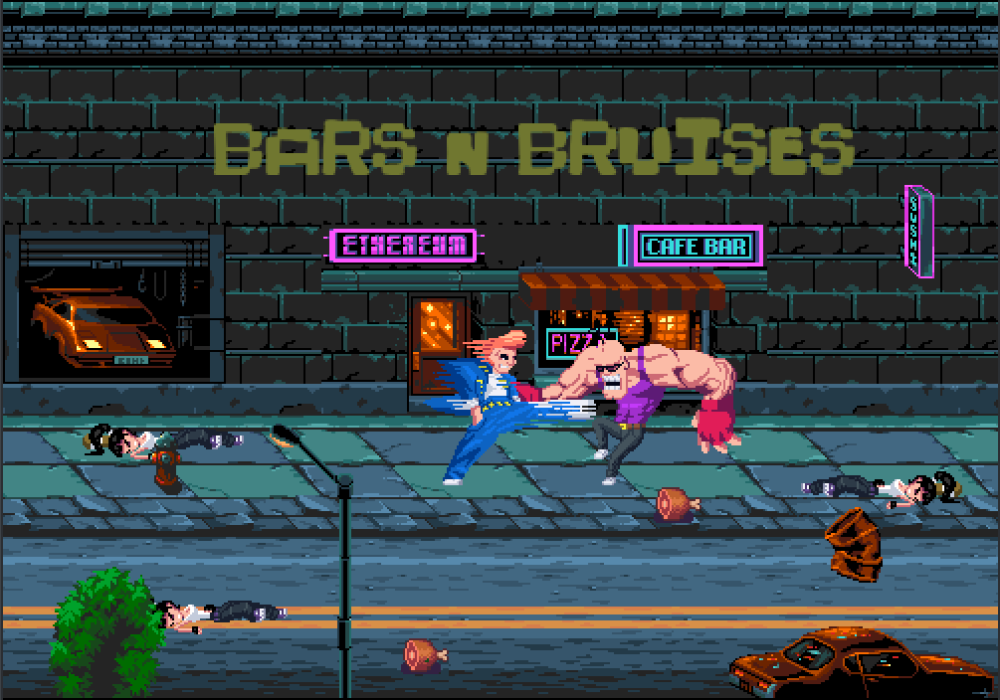

<div align="center">
    <h1>Bars n Bruises</h1>
    
    <h3>A Retro 2D Beat 'Em Up Built with Godot 4.4</h3>
</div>

**Bars n Bruises** is a pixel-art, arcade-style 2D beat 'em up game developed in Godot 4.4. Set in neon-lit streets and a gritty prison environment, you play as a fearless fighter battling delinquents to uphold equality. Punch, kick, and combo your way through enemies in crunchy 8-bit action, inspired by classic NES and arcade brawlers. With retro synth beats and side-scrolling chaos, this prototype delivers intense brawls and a modular, scalable codebase.

## 🎮 About the Game

In a world ruled by fear, gangs of delinquents oppress those who dare to treat all genders as equals. You are the last line of resistance, fighting through neon alleys and prison yards. **Bars n Bruises** combines:

- **Dynamic Combat**: Chain punches, kicks, and special attacks to create devastating combos.
- **Pixel-Art Aesthetic**: Crunchy 8-bit visuals with vibrant neon environments.
- **Retro Vibes**: Synth-heavy soundtrack and classic arcade gameplay.
- **Scalable Architecture**: Built with Godot 4.4 using GDScript, with plans for C++ optimization via GDExtension.

## 🕹️ Controls

| Action         | Key / Button |
| -------------- | ------------ |
| Move           | Arrow Keys   |
| Jump           | Spacebar     |
| Attack         | X / C        |
| Special Attack | Z            |
| Pause / Menu   | Esc          |

## 🛠️ Installation

1. **Clone the Repository**:
   ```bash
   git clone https://github.com/kamalkdolikay/bars-n-bruises.git
   cd bars-b-bruises
   ```
2. **Open in Godot**:
   - Launch Godot 4.4.
   - Import the `bars-b-bruises/project.godot` project.
3. **Run the Game**:
   - Set `res://world/scene/world.tscn` as the main scene.
   - Press `F5` to start and test movement with Arrow Keys.

## 📋 Project Details

- **Engine**: Godot 4.4
- **Language**: GDScript for prototyping, transitioning to C++ for performance-critical systems
- **Platforms**: PC, Web (playable in browser via itch.io)
- **License**: MIT License
- **Folder Structure**: Modular design for scalability (see [FolderStructure.md](FolderStructure.md))

## 🤝 Contributing

Contributions are welcome! Follow these steps to contribute:

1. Fork the repository and create a feature branch (`git checkout -b your-feature-name`).
2. Follow the commit message guidelines in [GitCommitStandards.md](GitCommitStandards.md).
3. Submit a pull request to the `main` branch.
4. Ensure code adheres to GDScript naming conventions and SOLID principles (see [FolderStructure.md](FolderStructure.md)).

All contributions are licensed under the MIT License.

## 🙌 Credits

- **Oonquil**: [Urban Brawlers](https://oonquil.itch.io/) (pixel art assets)
- **Ansimuz**: [Streets of Fight](https://ansimuz.itch.io/streets-of-fight) (pixel art assets)
- **Community**: Free and open pixel art assets from [itch.io](https://itch.io) and the Godot community

## 📥 Play Now

Relive the arcade glory or fight pixelated injustice! Play **Bars n Bruises** on:

- **Windows**: [Download.zip](#) (coming soon)
- **Web**: [Play in browser](https://itch.io/embed-upload/14489674?color=0f2dca)

Ready to clean up the streets? No quarters needed!

## 🌐 Visit on itch.io

Check out the official **Bars n Bruises** page on itch.io for the latest updates, downloads, and community feedback:

- [**Play on itch.io**](https://pixelkd.itch.io/bars-n-bruises)

## 📜 License

This project is licensed under the MIT License. See [LICENSE](LICENSE) for details.
